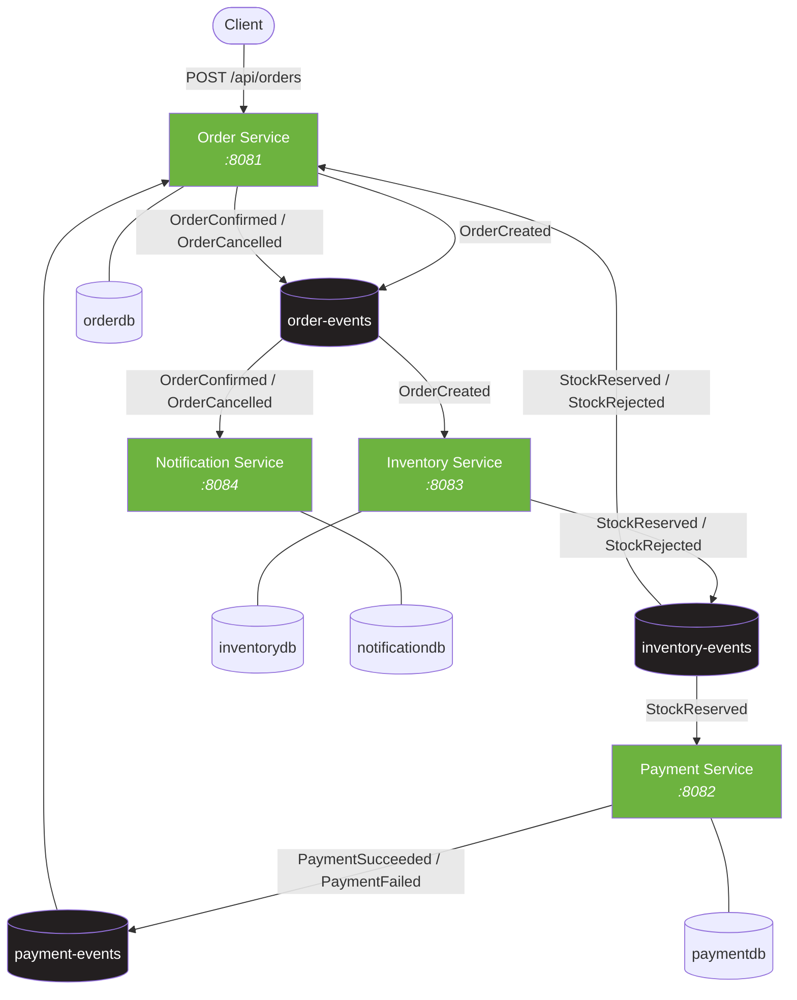
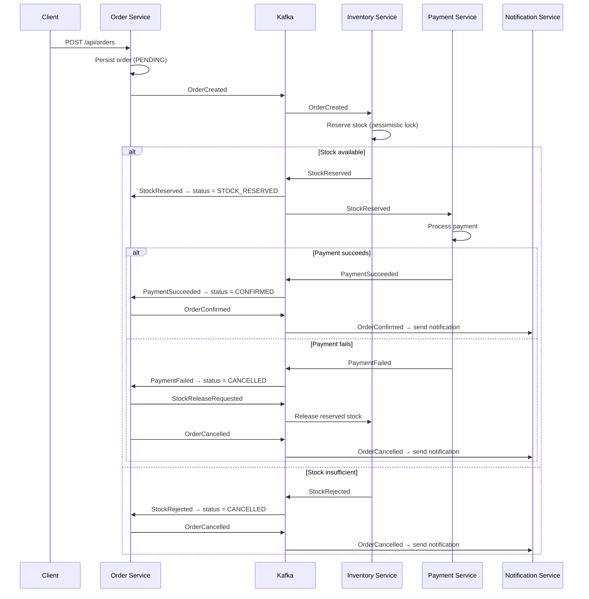

# Event-Driven Commerce Platform

> A production-grade microservices platform demonstrating distributed saga choreography,
> transactional outbox, idempotent consumers, and full observability — built with Java 21,
> Spring Boot, Kafka, and PostgreSQL.

<p align="center">
  
  
  
  
  
  
</p>

---

## Table of Contents

- [Why This Project](#why-this-project)
- [Architecture](#architecture)
- [Saga Flow](#saga-flow)
- [Tech Stack](#tech-stack)
- [Key Patterns & Design Decisions](#key-patterns--design-decisions)
- [Project Structure](#project-structure)
- [Getting Started](#getting-started)
- [API Reference](#api-reference)
- [Observability](#observability)
- [Testing Strategy](#testing-strategy)
- [Failure Scenarios & Resilience](#failure-scenarios--resilience)
- [Design Trade-offs](#design-trade-offs)

---

## Why This Project

Most microservices tutorials stop at REST calls between services. Real distributed systems need to solve much harder problems: **What happens when Kafka is down? What if a payment fails mid-saga? How do you prevent duplicate orders?**

This platform tackles those questions head-on. It implements a complete order fulfillment saga across 4 services with:

- **Zero data loss** — transactional outbox ensures events are never lost, even during Kafka outages
- **Exactly-once business semantics** — idempotency keys + processed event tracking prevent duplicates at every layer
- **Automatic compensation** — payment failures trigger stock rollback without manual intervention
- **Full observability** — distributed traces, Prometheus metrics, and pre-built Grafana dashboards

---

## Architecture



Each service owns its database and communicates **exclusively through Kafka events**. There is no service-to-service HTTP communication — all coordination happens via event-driven choreography.

---

## Saga Flow

The order fulfillment saga follows this sequence:



---

## Tech Stack

| Layer | Technology | Purpose |
|-------|-----------|---------|
| **Language** | Java 21 | Modern LTS with virtual threads, pattern matching, records |
| **Framework** | Spring Boot 3.5 | Auto-configuration, dependency injection, actuator |
| **Messaging** | Apache Kafka (KRaft) | Event streaming with no Zookeeper dependency |
| **Database** | PostgreSQL 17 | ACID transactions, JSONB for event payloads |
| **Migrations** | Flyway | Version-controlled schema evolution (9 migrations) |
| **Serialization** | Jackson | JSON with `@JsonTypeInfo` for polymorphic event deserialization |
| **API Docs** | SpringDoc OpenAPI | Auto-generated Swagger UI per service |
| **Metrics** | Micrometer + Prometheus | Custom business counters + JVM/HTTP metrics |
| **Tracing** | OpenTelemetry + Tempo | Distributed traces across Kafka-connected services |
| **Dashboards** | Grafana | Pre-provisioned dashboards with request rates, saga flow, Kafka lag |
| **Testing** | Testcontainers + JUnit 5 | Real Postgres + Kafka in integration tests |
| **Containers** | Docker Compose + Jib | 9-container local stack, no Dockerfiles needed |

---

## Key Patterns & Design Decisions

### Transactional Outbox

Every service writes events to an `outbox_events` table **in the same database transaction** as the business operation. A `@Scheduled` publisher polls unpublished rows every 500ms and sends them to Kafka, then marks them published.

```
┌─────────────────────────────────────────┐
│           Single DB Transaction          │
│                                          │
│   1. INSERT INTO orders (...)            │
│   2. INSERT INTO outbox_events (...)     │
│                                          │
└─────────────────────────────────────────┘
              ↓ (async, 500ms poll)
┌─────────────────────────────────────────┐
│         Outbox Publisher                 │
│                                          │
│   3. SELECT unpublished (LIMIT 100)      │
│   4. Send to Kafka                       │
│   5. UPDATE published = true             │
│                                          │
└─────────────────────────────────────────┘
```

**Why not publish directly to Kafka in the service?** Because if Kafka is down or the app crashes between DB commit and Kafka send, the event is lost. The outbox guarantees at-least-once delivery with zero data loss.

### Idempotency at Every Layer

| Layer | Mechanism |
|-------|-----------|
| **API** | `Idempotency-Key` header + SHA-256 request hashing. Same key + same payload → cached response (200). Same key + different payload → 409 Conflict. |
| **Consumers** | `processed_events` table checked inside the same transaction. Duplicate `eventId` → skip. |
| **Outbox** | `eventId` as Kafka message key. Redelivery produces the same message. |

### Order Status State Machine

Order transitions are enforced by a state machine — invalid transitions are rejected:

```
PENDING ──→ STOCK_RESERVED ──→ CONFIRMED
   │              │
   └──→ CANCELLED ←┘
```

### Pessimistic Locking for Stock

Inventory uses `SELECT ... FOR UPDATE` with items **sorted by productId** to prevent deadlocks when multiple orders reserve the same products concurrently.

### Saga Choreography (No Orchestrator)

Services react to events autonomously. There is no central saga orchestrator — each service knows only about the events it consumes and produces.

### Dead Letter Topics

Failed messages are retried 3 times with 1-second backoff, then routed to `<topic>.DLT` for manual inspection.

---

## Project Structure

```
event-driven-commerce-platform/
│
├── shared/
│   └── events/                          # Shared event schemas (JAR)
│       └── src/main/java/
│           └── com/platform/events/
│               ├── EventEnvelope.java   # Generic event wrapper
│               ├── EventTypes.java      # Event type constants
│               ├── OrderLineItem.java   # Shared value object
│               ├── order/               # OrderCreated, OrderConfirmed, ...
│               ├── inventory/           # StockReserved, StockRejected, ...
│               ├── payment/             # PaymentSucceeded, PaymentFailed
│               └── serde/              # Kafka serializer/deserializer
│
├── services/
│   ├── order-service/                   # REST API + saga coordinator
│   ├── inventory-service/               # Stock management + reservations
│   ├── payment-service/                 # Payment simulation
│   └── notification-service/            # Email notifications (mock)
│
├── infra/
│   ├── docker-compose.yml               # Full 9-container local stack
│   ├── init-databases.sql               # Creates 4 logical databases
│   ├── prometheus/prometheus.yml
│   ├── tempo/tempo.yaml
│   └── grafana/
│       ├── provisioning/                # Auto-configured datasources
│       └── dashboards/                  # Pre-built JSON dashboards
│
└── docs/
    ├── architecture.md                  # Deep dive into design
    ├── failure-scenarios.md             # 8 failure modes + mitigations
    └── runbook.md                       # Operations guide
```

---

## Getting Started

### Prerequisites

- **Java 21** (Temurin recommended)
- **Maven 3.9+**
- **Docker Desktop** with Docker Compose v2

### Build & Run

```bash
# 1. Clone
git clone https://github.com/OriolJT/event-driven-commerce-platform.git
cd event-driven-commerce-platform

# 2. Build all modules
mvn clean install -DskipTests

# 3. Build Docker images (Jib — no Dockerfiles needed)
mvn -pl services/order-service,services/payment-service,services/inventory-service,services/notification-service jib:dockerBuild

# 4. Start the full stack (Postgres, Kafka, 4 services, Prometheus, Grafana, Tempo)
cd infra && docker compose up -d
```

### Verify It Works

```bash
# Create an order
curl -s -X POST http://localhost:8081/api/orders \
  -H "Content-Type: application/json" \
  -H "Idempotency-Key: demo-001" \
  -d '{
    "customerId": "aaaaaaaa-aaaa-aaaa-aaaa-aaaaaaaaaaaa",
    "items": [
      {"productId": "11111111-1111-1111-1111-111111111111", "quantity": 2, "unitPrice": 29.99}
    ],
    "currency": "EUR"
  }' | jq .

# Check order status — should transition to CONFIRMED or CANCELLED within seconds
curl -s http://localhost:8081/api/orders/{orderId} | jq .

# Test idempotency — same request returns cached response
curl -s -X POST http://localhost:8081/api/orders \
  -H "Content-Type: application/json" \
  -H "Idempotency-Key: demo-001" \
  -d '{
    "customerId": "aaaaaaaa-aaaa-aaaa-aaaa-aaaaaaaaaaaa",
    "items": [
      {"productId": "11111111-1111-1111-1111-111111111111", "quantity": 2, "unitPrice": 29.99}
    ],
    "currency": "EUR"
  }' | jq .
# → Returns 200 (cache hit) with identical response body
```

### Shutdown

```bash
cd infra && docker compose down -v
```

---

## API Reference

### Order Service (:8081)

| Method | Endpoint | Description | Headers |
|--------|----------|-------------|---------|
| `POST` | `/api/orders` | Create a new order | `Idempotency-Key` (required) |
| `GET` | `/api/orders/{id}` | Get order by ID | — |

> Swagger UI available at [http://localhost:8081/swagger-ui.html](http://localhost:8081/swagger-ui.html) for all endpoints.

### Available Products (Seeded)

| Product ID | Name | Initial Stock |
|-----------|------|:------------:|
| `11111111-1111-1111-1111-111111111111` | Wireless Mouse | 100 |
| `22222222-2222-2222-2222-222222222222` | Mechanical Keyboard | 50 |
| `33333333-3333-3333-3333-333333333333` | USB-C Hub | 75 |
| `44444444-4444-4444-4444-444444444444` | 27" Monitor | 30 |
| `55555555-5555-5555-5555-555555555555` | Laptop Stand | 200 |

---

## Observability

The platform ships with a fully pre-configured observability stack:

| Tool | URL | Purpose |
|------|-----|---------|
| **Prometheus** | [localhost:9090](http://localhost:9090) | Metrics collection & querying |
| **Grafana** | [localhost:3000](http://localhost:3000) (admin/admin) | Dashboards & trace exploration |
| **Tempo** | Grafana → Explore → Tempo | Distributed trace search |

### Custom Business Metrics

```
orders_created_total          # Orders created
orders_confirmed_total        # Saga completed successfully
orders_cancelled_total        # Saga ended in cancellation
outbox_published_total        # Events published from outbox
stock_reserved_total          # Successful stock reservations
payments_processed_total      # Payments attempted
```

### Pre-Built Dashboard

The **Platform Service Overview** dashboard is auto-provisioned in Grafana with panels for:
- Request rate, error rate, and latency percentiles (p50/p95/p99)
- Saga flow counters (created → confirmed / cancelled)
- Kafka consumer lag per group
- JVM heap memory usage

### Distributed Tracing

OpenTelemetry trace context propagates automatically through Kafka headers via Spring Boot's Micrometer integration. Find end-to-end traces spanning all 4 services in Grafana → Explore → Tempo.

---

## Testing Strategy

Integration tests use **Testcontainers** to spin up real PostgreSQL and Kafka instances — no mocks, no in-memory substitutes.

```bash
# Run all tests (Docker must be running)
mvn test

# Run a specific service's tests
mvn test -pl services/order-service -am
```

| Service | Tests | What's Covered |
|---------|:-----:|----------------|
| **order-service** | 3 | Order creation + outbox event, idempotency cache hit (200), idempotency conflict (409) |
| **inventory-service** | 2 | Stock reservation (happy path), stock rejection (insufficient) |
| **payment-service** | 1 | Payment processing on StockReserved event |
| **Total** | **6** | **All pass** |

---

## Failure Scenarios & Resilience

<details>
<summary><b>Kafka goes down</b></summary>

Events are safely stored in each service's `outbox_events` table. When Kafka recovers, the outbox publisher picks up where it left off. Zero events lost.
</details>

<details>
<summary><b>Consumer crashes mid-processing</b></summary>

Manual offset acknowledgment (`ack-mode: record`) ensures the offset commits only after the listener completes. On restart, the message is redelivered. The `processed_events` table prevents double-processing.
</details>

<details>
<summary><b>Duplicate Kafka delivery</b></summary>

Every consumer checks `processed_events` for the `eventId` before processing. Duplicate messages are silently skipped.
</details>

<details>
<summary><b>Payment fails after stock is reserved</b></summary>

Order service emits `StockReleaseRequested`. Inventory service releases the reservation and restores stock. The saga self-heals via compensation.
</details>

<details>
<summary><b>Poison / malformed messages</b></summary>

`DefaultErrorHandler` retries 3 times with 1s backoff, then routes to `<topic>.DLT` (Dead Letter Topic) for manual inspection. Processing continues for other messages.
</details>

<details>
<summary><b>Database unavailable</b></summary>

Services fail health checks. Kafka consumers stop processing. Events remain safely in Kafka until the database recovers and services restart.
</details>

<details>
<summary><b>Outbox publisher crashes after Kafka send</b></summary>

If the publisher crashes before marking a row as `published`, the event is re-sent on the next poll. Downstream consumers handle the duplicate via idempotency.
</details>

<details>
<summary><b>Concurrent stock reservation (race condition)</b></summary>

Inventory service uses `SELECT ... FOR UPDATE` (pessimistic locking) with items sorted by `productId` to prevent deadlocks and ensure correct stock decrements under concurrency.
</details>

---

## Design Trade-offs

| Decision | Chosen | Alternative | Why |
|----------|--------|-------------|-----|
| **Choreography** vs orchestration | Choreography | Saga orchestrator (e.g., Temporal) | Looser coupling, no single point of failure. Trade-off: harder to visualize full flow |
| **Outbox polling** vs CDC | Polling (500ms) | Debezium CDC | Simpler infra, no connector to manage. Trade-off: slight publish latency |
| **One topic per context** vs per event type | Per context | `order-created-topic`, `stock-reserved-topic`, etc. | Preserves per-order ordering, fewer topics to manage |
| **Pessimistic** vs optimistic locking (inventory) | Pessimistic | `@Version` with retry | Stock decrements must never go negative; pessimistic is simpler to reason about |
| **Optimistic** locking (orders) | `@Version` field | Pessimistic | Orders have low contention from concurrent saga events; optimistic avoids DB lock waits |
| **JSON** vs Avro/Protobuf | JSON | Schema Registry + Avro | Human-readable, no schema registry to manage. Trade-off: larger payloads, no schema evolution guarantees |
| **Single Postgres** with logical DBs | Single instance | Separate Postgres per service | Saves resources locally. In production, each service would have its own instance |

---

<p align="center">
  Built by <a href="https://github.com/OriolJT">OriolJT</a>
</p>
